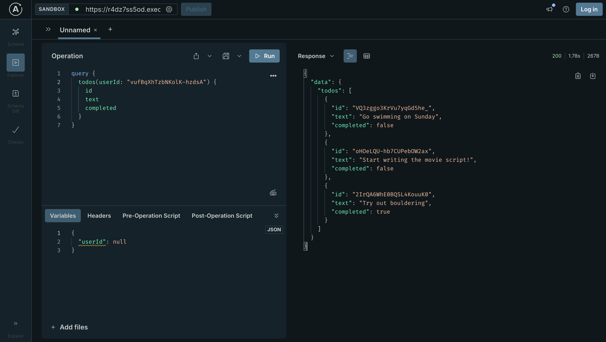

# To-Do Backend

A minimal GraphQL server for managing user-scoped to-do items, built with Apollo Server and deployed on AWS Lambda. It supports user authentication (signup/login with dummy auth) and CRUD operations for to-do items, with data stored in an S3 bucket using a simple file-based persistence mechanism (`database.json`).

## Features

- **GraphQL API**: Powered by Apollo Server for efficient querying and mutations.
- **User Management**: Supports signup and login with dummy authentication (no password hashing).
- **To-Do CRUD**: Create, read, update, and delete to-do items, scoped to individual users.
- **Data Persistence**: Stores data in an AWS S3 bucket (`database.json`) using lowdb-like structure.
- **Deployment**: Deployed on AWS Lambda for serverless scalability, with CORS enabled for frontend integration.
- **Development**: Supports local development with `serverless-offline` plugin.

## Tech Stack

- **Node.js**: Runtime environment (v18.x).
- **Apollo Server**: GraphQL server implementation.
- **AWS SDK**: For S3 interactions to store/retrieve data.
- **Nanoid**: For generating unique IDs for users and to-dos.
- **Serverless Framework**: For deploying to AWS Lambda and managing infrastructure.
- **AWS S3**: File-based persistence for `database.json`.

## Getting Started

### Prerequisites

- Node.js (v18.x or higher)
- AWS account with credentials configured
- Serverless Framework CLI (`npm install -g serverless`)
- Git

### Installation

1. **Clone the repository**:
   ```bash
   git clone https://github.com/aphyueh/to-do-backend.git
   cd to-do-backend
   ```

2. **Install dependencies**:
   ```bash
   npm install
   ```

3. **Configure environment variables**:
   Create a `.env` file in the root directory and add your AWS S3 bucket name:
   ```env
   S3_BUCKET=graphql-backend-dev-database
   ```

4. **Run locally**:
   Use the Serverless Offline plugin to start the GraphQL server locally:
   ```bash
   serverless offline
   ```
   The GraphQL playground will be available at `http://localhost:4000/graphql`.

### Deployment

1. **Configure AWS credentials**:
   Ensure your AWS credentials are set up in `~/.aws/credentials` or via environment variables.

2. **Deploy to AWS Lambda**:
   ```bash
   serverless deploy
   ```
   This will deploy the GraphQL API to AWS Lambda and create the S3 bucket defined in `serverless.yml`. The endpoint URL will be displayed in the console output.



## Mobile App and Website Github Repo
https://github.com/aphyueh/to-do-mobile-app
https://github.com/aphyueh/to-do-web


### Types
- **User**:
  ```graphql
  type User {
    id: ID!
    name: String!
    email: String!
  }
  ```
- **Todo**:
  ```graphql
  type Todo {
    id: ID!
    text: String!
    userId: ID!
    completed: Boolean!
  }
  ```

### Queries
- `hello`: Returns a simple greeting (`String`).
- `users`: Lists all users (`[User]`).
- `todos(userId: ID!)`: Lists to-do items for a specific user (`[Todo]`).

### Mutations
- `signup(name: String!, email: String!, password: String!)`: Creates a new user (`User`).
- `login(email: String!, password: String!)`: Logs in a user (dummy auth, returns `User`).
- `addTodo(userId: ID!, text: String!)`: Creates a new to-do item (`Todo`).
- `deleteTodo(id: ID!)`: Deletes a to-do item (`Boolean`).
- `toggleTodoCompleted(id: ID!)`: Toggles the completion status of a to-do item (`Todo`).

### Example Query
```graphql
query {
  todos(userId: "user123") {
    id
    text
    completed
  }
}
```

### Example Mutation
```graphql
mutation {
  addTodo(userId: "user123", text: "Buy groceries") {
    id
    text
    completed
  }
}
```

## Data Storage

- Data is stored in an AWS S3 bucket in a `database.json` file with the following structure:
  ```json
  {
    "users": [{ "id": "user123", "name": "John Doe", "email": "john@example.com" }],
    "todos": [{ "id": "todo456", "text": "Buy groceries", "userId": "user123", "completed": false }]
  }
  ```
- The `readDatabase` and `writeDatabase` functions handle S3 interactions for persistence.

## Project Structure

```plaintext
to-do-backend/
├── lambda.js           # Apollo Server setup and GraphQL resolvers
├── serverless.yml      # Serverless Framework configuration
├── package.json        # Node.js dependencies and scripts
└── .env                # Environment variables (not tracked)
```

## Notes

- **Authentication**: The current implementation uses dummy authentication (no password hashing). For production, consider adding proper authentication (e.g., JWT, bcrypt).
- **Persistence**: The file-based storage in S3 (`database.json`) is simple but may not scale for large datasets. Consider a database like DynamoDB for production use.
- **CORS**: Configured to allow cross-origin requests, suitable for frontend integration.

## Author

**Amber Pang** - [GitHub Profile](https://github.com/aphyueh)
